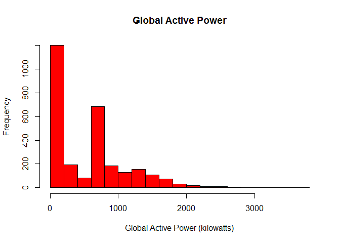
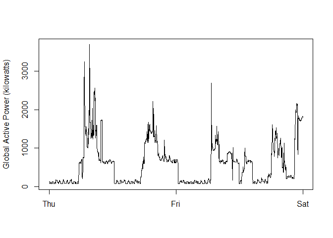
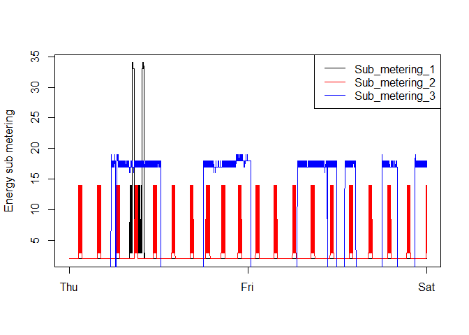
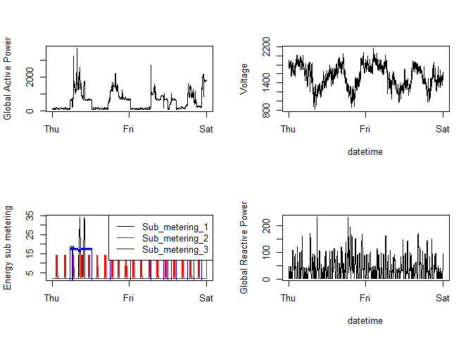

# Exploring Data Course Project #1
Kaushik Pushpavanam  
November 7th, 2015  
##Title: Exploring Data Course Project #1

Let's first install required packages

```r
list.of.packages <- c("R.utils", "lubridate", "dplyr")
new.packages <- list.of.packages[!(list.of.packages %in% installed.packages()[,"Package"])]
if(length(new.packages)) {
  install.packages(new.packages)
  library(new.packages)
}
```

Let's estimate how much data we have
Size of row = 2 dates + 7 numbers = 2 x 4 bytes + 7 x 4 bytes = 9 x 4 bytes = 36 bytes
2,075,259 rows x size of row (36 bytes)
2,075,259 x 36 bytes = 2,075,259 x 36 / 1024 KB = 2,075,259 x 36 / (1024 x 1024) MB
That's approx 2 million/1million x 36 in MB = 2 x 36 MB = 72 MB

My machine has lot more - so we are good!
#Download the file
Now, let's download the data

```r
require(R.utils)
```

```
## Loading required package: R.utils
## Loading required package: R.oo
## Loading required package: R.methodsS3
## R.methodsS3 v1.7.0 (2015-02-19) successfully loaded. See ?R.methodsS3 for help.
## R.oo v1.19.0 (2015-02-27) successfully loaded. See ?R.oo for help.
## 
## Attaching package: 'R.oo'
## 
## The following objects are masked from 'package:methods':
## 
##     getClasses, getMethods
## 
## The following objects are masked from 'package:base':
## 
##     attach, detach, gc, load, save
## 
## R.utils v2.1.0 (2015-05-27) successfully loaded. See ?R.utils for help.
## 
## Attaching package: 'R.utils'
## 
## The following object is masked from 'package:utils':
## 
##     timestamp
## 
## The following objects are masked from 'package:base':
## 
##     cat, commandArgs, getOption, inherits, isOpen, parse, warnings
```

```r
setwd("C:/Users/iyer/Projects/ExploringDataCourseProject1/ExData_Plotting1")
url <- "https://d396qusza40orc.cloudfront.net/exdata%2Fdata%2Fhousehold_power_consumption.zip"
zipFile <- "./data/household_power_consumption.zip"
file <- "household_power_consumption.txt"
fileWithPath <- "./data/household_power_consumption.txt"
if (!file.exists("./data")) {
	dir.create("./data")
}
if (!file.exists(zipFile)) {
	download.file(url,destfile=zipFile)
}
if (!file.exists(file)) {
	unzip(zipFile, files=file)
  file.rename(file,fileWithPath)
}
```

```
## [1] TRUE
```

```r
dataset <- read.table(fileWithPath, sep=";", header=TRUE)
```

Now let's filter and format the data by removing rows/columns we do not need.


```r
dataset$DateTime = strptime(paste(dataset$Date, dataset$Time), "%d/%m/%Y %H:%M:%S") #make date/time usable
RangeStart = as.Date("2007-02-01 00:00:00", "%Y-%m-%d %H:%M:%S", tz="GMT")
RangeEnd   = as.Date("2007-02-02 23:59:59", "%Y-%m-%d %H:%M:%S", tz="GMT")
dataset = dataset[as.Date(dataset$DateTime) >= as.Date(RangeStart),]
dataset = dataset[as.Date(dataset$DateTime) <= as.Date(RangeEnd),]
#rows pruned

#fix columns by making them numeric
dataset$Global_active_power   = as.numeric(dataset$Global_active_power)
dataset$Global_reactive_power = as.numeric(dataset$Global_reactive_power)
dataset$Voltage               = as.numeric(dataset$Voltage)
dataset$Global_intensity      = as.numeric(dataset$Global_intensity)
dataset$Sub_metering_1        = as.numeric(dataset$Sub_metering_1)
dataset$Sub_metering_2        = as.numeric(dataset$Sub_metering_2)
dataset$Sub_metering_3        = as.numeric(dataset$Sub_metering_3)
```

Plot 1


```r
dev.set(2)
```

```
## png 
##   2
```

```r
hist(dataset$Global_active_power, col="red", xlab="Global Active Power (kilowatts)", main="Global Active Power")
```

 

```r
dev.copy(png, file="plot1.png", width=480, height=480)
```

```
## png 
##   3
```

```r
dev.off()
```

```
## png 
##   2
```

Plot 2

```r
dev.set(2)
```

```
## png 
##   2
```

```r
plot(dataset$DateTime, dataset$Global_active_power, type="l", xlab="", ylab="Global Active Power (kilowatts)")
```

 

```r
dev.copy(png, file="plot2.png", width=480, height=480)
```

```
## png 
##   3
```

```r
dev.off()
```

```
## png 
##   2
```

Plot 3

```r
dev.set(2)
```

```
## png 
##   2
```

```r
with(dataset, plot(DateTime, Sub_metering_1, main="", xlab="",ylab="Energy sub metering", type="l"))
lines(dataset$DateTime, dataset$Sub_metering_2, type="l", col="red")
lines(dataset$DateTime, dataset$Sub_metering_3, type="l", col="blue")
legend("topright", legend=c("Sub_metering_1","Sub_metering_2","Sub_metering_3"), col=c("black", "red", "blue"), lty=1, lwd=1);
```

 

```r
dev.copy(png, file="plot3.png", width=480, height=480)
```

```
## png 
##   3
```

```r
dev.off()
```

```
## png 
##   2
```

plot 4

```r
dev.set(2)
```

```
## png 
##   2
```

```r
par(mfrow=c(2,2))
plot(dataset$DateTime, dataset$Global_active_power, type="l", xlab="", ylab="Global Active Power")
plot(dataset$DateTime, dataset$Voltage, type="l", xlab="datetime", ylab="Voltage")
with(dataset, plot(DateTime, Sub_metering_1, main="", type="l", xlab="",ylab="Energy sub metering"))
lines(dataset$DateTime, dataset$Sub_metering_2, type="l", col="red")
lines(dataset$DateTime, dataset$Sub_metering_3, type="l", col="blue")
legend("topright", legend=c("Sub_metering_1","Sub_metering_2","Sub_metering_3"), col=c("black", "red", "blue"), lty=1, lwd=1);
plot(dataset$DateTime, dataset$Global_reactive_power, type="l", xlab="datetime", ylab="Global Reactive Power")
```

 

```r
dev.copy(png, file="plot4.png", width=480, height=480)
```

```
## png 
##   3
```

```r
dev.off()
```

```
## png 
##   2
```
